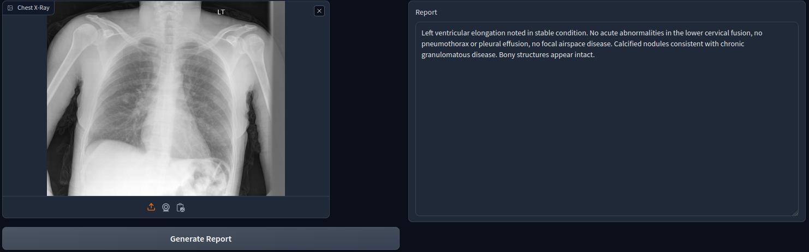
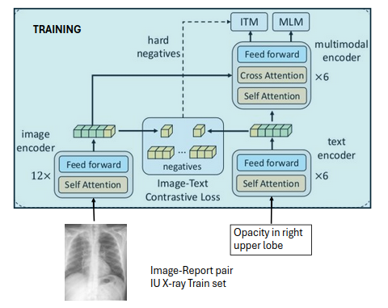
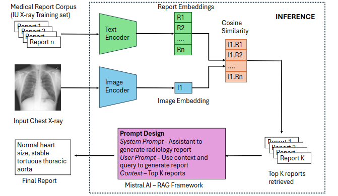

# MistralAI-XRay

This is the repository for MistralAI-XRay.
This project uses a hybrid artificial intelligence
framework that combines the Vision Language Model - ALBEF
(Align Before Fuse) with the Retrieval-Augmented Generation
(RAG) framework to automatically generate medical reports
from Chest X-ray images. Initially trained on the Indiana
University Open-i dataset, ALBEF retrieves relevant medical
reports as contextual references. These reports are then used
as prompts in the RAG framework, which works with the
open-source generative model Mistral AI open-mistral-7b, to
create detailed and accurate radiological findings. This approach
generates reports that are coherent with a radiologist’s written
report and can also be tailored to specific clinical settings through
prompt engineering. The goal is to enhance report accuracy
and reduce the time healthcare professionals spend on the time-
consuming task of report generation.

MistralAI-XRay Web-app using Gradio
<p align="center">
  
</p>

MistralAI-XRay Training using ALBEF:
<p align="center">
  
</p>

MistralAI-XRay Inference with RAG:
<p align="center">
  
</p>


## Setup

> Download pre-trained weights for CheXbert and ALBEF
- [CheXbert](https://github.com/stanfordmlgroup/CheXbert)

```bash
cd CheXbert
```

> download the [pretrained weights](https://stanfordmedicine.box.com/s/c3stck6w6dol3h36grdc97xoydzxd7w9) for CheXbert.

- [CXR-RePaiR](https://github.com/rajpurkarlab/CXR-RePaiR)

- [CXR-Report-Metric](https://github.com/rajpurkarlab/CXR-Report-Metric)

```bash
mv CXR-Report-Metric_CXR_ReDonE_code/* CXR-Report-Metric/
rm -rf CXR-Report-Metric_CXR_ReDonE_code
```

- [ALBEF](https://github.com/salesforce/ALBEF)

> Make sure to download [ALBEF_4M.pth](https://storage.googleapis.com/sfr-pcl-data-research/ALBEF/ALBEF_4M.pth) (`wget https://storage.googleapis.com/sfr-pcl-data-research/ALBEF/ALBEF_4M.pth`) and place it in `ALBEF/`.


> #### Environment Setup

```bash
cd CXR-RePaiR
conda env create -f cxr-repair-env.yml
conda activate cxr-repair-env
```

## Training

To train ALBEF using Open-i(IU Chest X-ray) dataset, run:

```bash
cd Training-Inference-Evaluation/ALBEF
sh train_script.sh
```

Linked here are the ALBEF model checkpoints [with](https://www.dropbox.com/s/b4tkf2z4v6wa4zj/checkpoint_59.pth?dl=0) and [without](https://drive.google.com/file/d/183TClsB_fzCOHa6ESWfefV6EoN0EfmMI/view?usp=sharing) removing references to priors from the MIMIC-CXR reports corpus.

## Inference
Download the [ollama](https://ollama.com/download) before running Mistral for inference.<br />
To run inference, run the following:


```bash
cd Training-Inference-Evaluation
sh inference.sh
```


## Evaluation

For evaluating the generated reports, CXR-Report-Metric to be used:

### Setup

```bash
cd Training-Inference-Evaluation/CXR-Report-Metric
conda create -n "cxr-report-metric" python=3.7.0 ipython
conda activate cxr-report-metric
pip install -r requirements.txt
```

### Evaluation

1. Use `prepare_df.py` to add the uid to the prediction from the Mistral AI.

```
cd ../CXR-Report-Metric_CXR_ReDonE_code
python prepare_df.py --fpath <input path> --opath <output path> --rpath <test report path>
```

2. In `config.py`, set `GT_REPORTS` to `../../Dataset/Open-i/testReport.csv` and `PREDICTED_REPORTS` to `<output path>`. Set `OUT_FILE` to the desired path for the output metric scores. Set `CHEXBERT_PATH` to the path to the downloaded checkpoint (`CheXbert/chexbert.pth`).

3. Use `test_metric.py` to generate the scores.

```
cd ../CXR-Report-Metric
python test_metric.py
```

4. Finally, use `evaluate_avgMetric.py` to output the average scores.

```
cd ..
python3 evaluate_avgMetric.py --fpath <input path>
```

### Gradio Web-app

1. Use `app_online.py` to run the Gradio based web-app locally.

```
cd Training-Inference-Evaluation/ALBEF
python app_online.py 
```